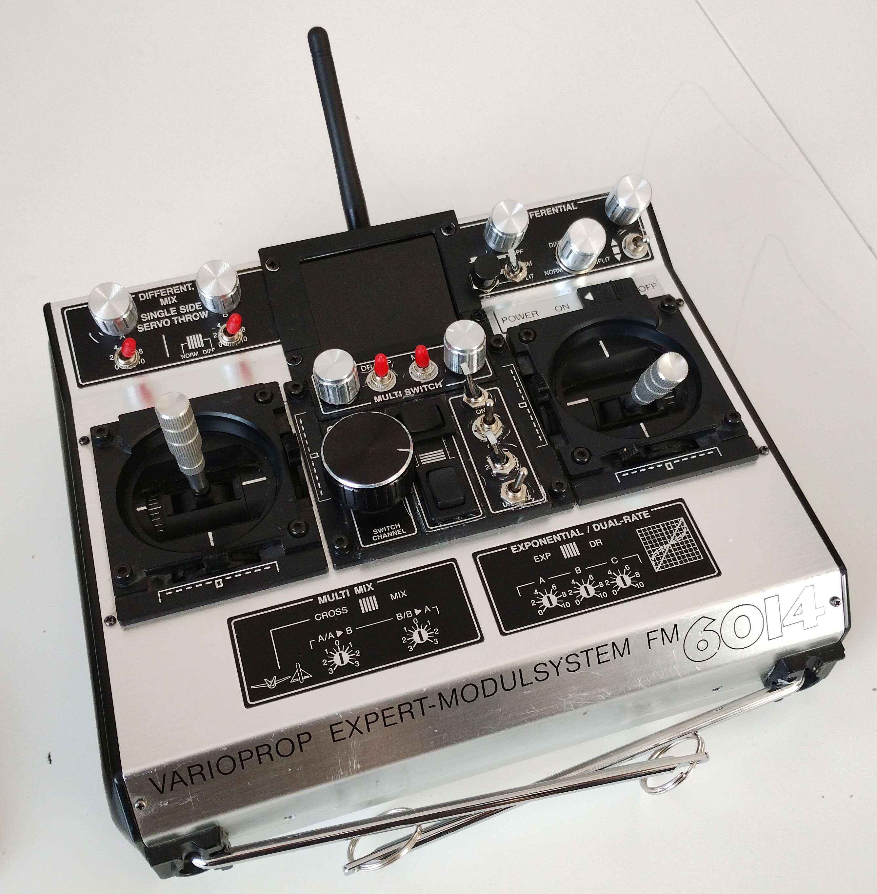

# RadioControl

This project is about a self-made radio control for scale modeling.
Based on the old radio control Graupner FM6014, the body is fully gutted, so that only the joysticks and the corresponding trimmers remain.
In the next step, the electronic is set up by an Arduino Mega 2560 pro for the control functionality.
The finally needed CPPM (continous pulse pause modulation) signal is provided by this microcontroller.
A second Arduino Nano controller is used only to communicate to the display and to prevent all communication delays from the Mega.
The communication between both is based on standard Rx/Tx serial interface.

Further details and description will follow....
