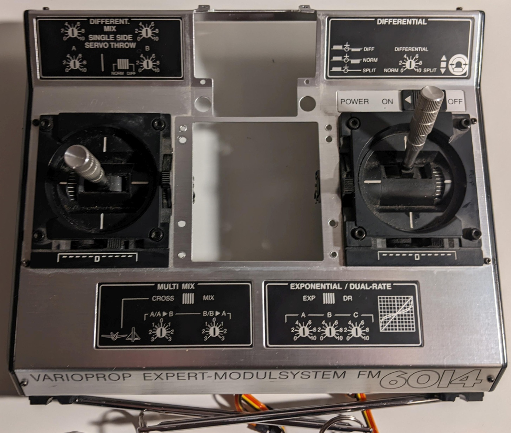
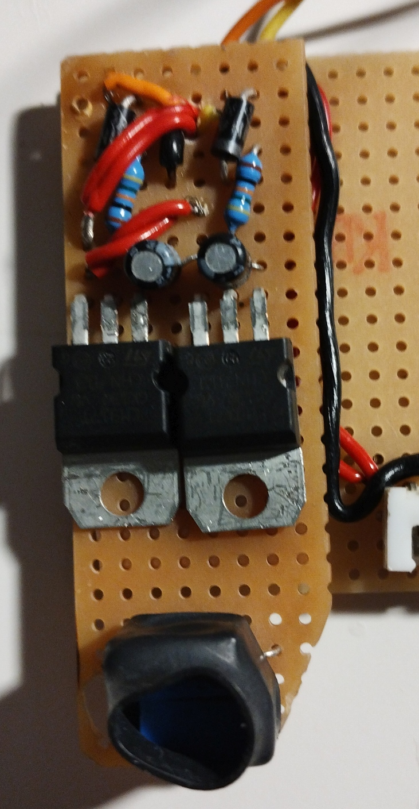

# Hardware Aufbau

## Außenansicht: Module und Einteilung

## Entkernung Gehäuse

## Modulschächte und Display: Anschluss und Verkabelung

   

## Verkabelung

## Einhausung Display

### Housing based on standard "Winkelschiene"

### Details

## Mounting- und Gateway-Board: Arduino Mega
Nur das untere Board für den Arduino Mega ist korrekt. Die Display-Anbindung wurde überarbeitet.

## Mounting- und Gateway-Board: Arduino Nano und Display

## Innenausbau: Anschluss Arduino Boards

## Finaler Stand
LEDs für die Betriebsanzeige sind noch zu ergänzen.

